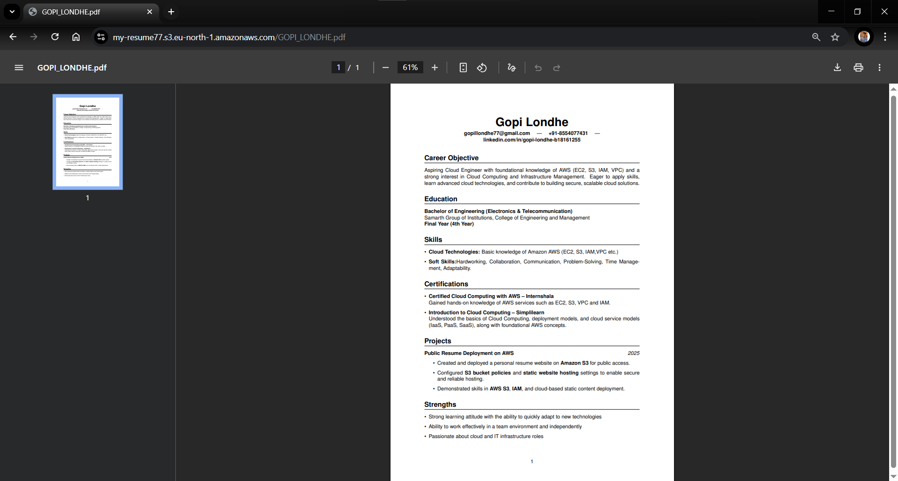

# Public Resume Deployment on AWS

This project demonstrates hosting a resume on Amazon S3 using Static Website Hosting.  
It was created to showcase basic Cloud Deployment Skills with AWS services.

---

## 🚀 Live Demo
[View Hosted Resume](https://my-resume77.s3.eu-north-1.amazonaws.com/GOPI_LONDHE.pdf)

---

## 🛠 Skills & Tools Used
- Amazon S3 – Hosting the resume as a static website.
- AWS IAM – Managing user permissions and security.
- Static Website Hosting – Enabling the bucket to serve website content.
- Bucket Policies – Configuring public access for the hosted file.
- Cloud Concepts – Storage, access control, and deployment basics.

---

## 📸 Screenshot

---

## 📋 Deployment Steps
1. Create an S3 Bucket in AWS.
2. Upload Resume PDF or website files to the bucket.
3. Enable Static Website Hosting in bucket properties.
4. Set Public Access Permissions using bucket policy.
5. Copy the Public URL and share it.

---

## 📌 Project Purpose
This project was built to:
- Practice AWS S3 configuration.
- Learn static website hosting.
- Showcase cloud deployment skills to potential employers.

---

## 👤 Author
Gopi Londhe  
[LinkedIn](https://linkedin.com/in/gopi-londhe-b18161255)
